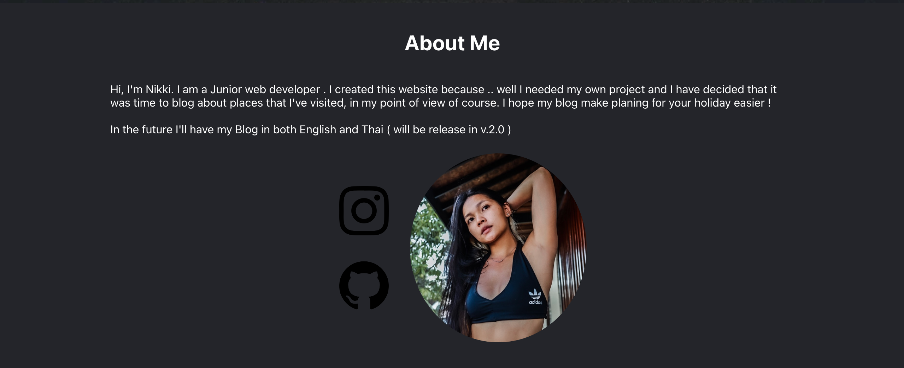
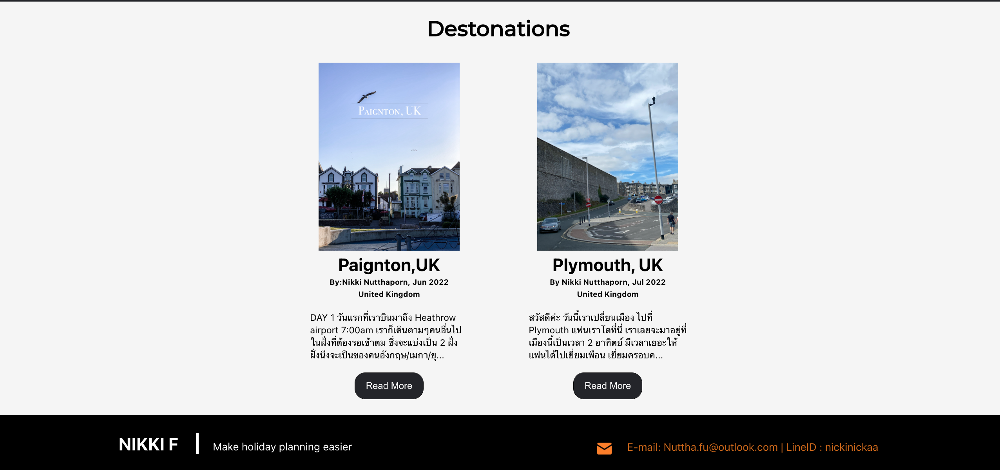

<h1 align="center">My travel Blog</h1>

this is my website that **I'm still developing** as my basic project.
i wanted to write more about trips and placing that i've been over the past year, so i can appreciate the time i had and I can share to other people hoping this can make others trip planing a little eaier !.
#Stack i use

  
  
  
  
  
  
  
  
  
  
  
  
 

**developping plan**:
- add Blog Page and Destination Searching Bar 
- Respondsive to any device mobiles, tablets, laptops, and desktops!
- add nav drop down for visited countries

## Preview Images

